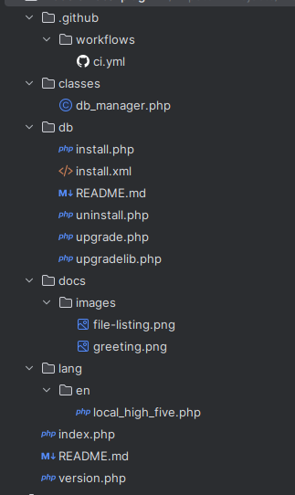
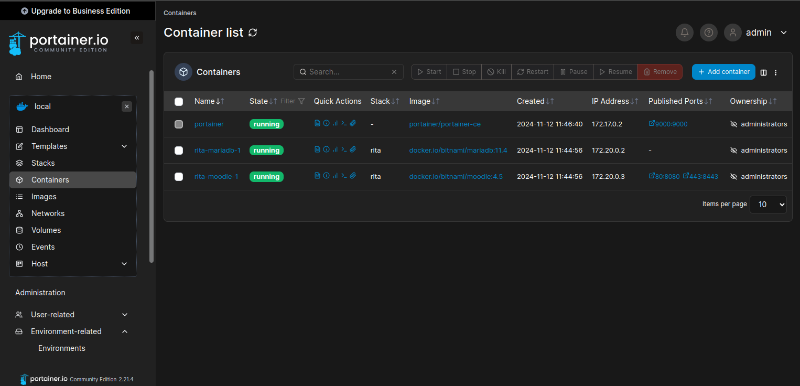

# Moodle Plugin Template

Use this template as a starting point for developing Moodle plugins.

**STATUS:** This is a work-in-progress, supporting discussions on best practices.



## Key features

This template provides a structured, best-practice-compliant foundation for developing Moodle plugins, including:

- 📝 Installation instructions for users
- 🔧 Build system and CI/CD setup using GitHub Actions
- 🌍 Localization for all strings
- ✅ Automated code style checks
- 🚀 Optional: Unit tests, Behat tests, static analysis, logging, and backup support

This repository offers a functional example of a Moodle plugin, with features like:

- [x] **Database initialization and upgrade** scripts
- [ ] **Dashboard Context block** (`CONTEXT_USER`) to display content on student dashboards ("My home")
- [ ] **Course content block** (`CONTEXT_COURSE`) to display content on course pages
- [ ] **Activity block** (`CONTEXT_MODULE`) to display content on activity pages
- [ ] **Settings page** to configure the plugin using the standard Moodle admin settings interface
- [ ] **Admin page** to access functionality of this plugin that only administrators should see
- [ ] **Scheduled task** to run background processing
- [ ] **Custom JavaScript** for the user interface, which is built using (AMD??)

You can use these features as they are, modify them, or remove what you don’t need.

## Best practices and resources

Follow these best practices to enhance and maintain your plugin:

- **JavaScript Compilation:** [Moodle Node.js Guide](https://moodledev.io/general/development/tools/nodejs)
- **AMD Compilation:** Examples:
    - [h5p plugin](https://github.com/h5p/moodle-mod_hvp)
    - [attendance plugin](https://github.com/danmarsden/moodle-mod_attendance/tree/MOODLE_404_STABLE/amd)
- **CI Setup:** [Moodle CI Guide](https://moodlehq.github.io/moodle-plugin-ci/)
- **General Examples:** [attendance plugin](https://github.com/danmarsden/moodle-mod_attendance)

## Making your own plugin

1. **Fork this repository** and rename it according to Moodle conventions:
    - Format: `moodle-<type>_<pluginname>` (e.g., `moodle-local_example`)
    - `<type>` should match Moodle’s [plugin types](https://moodledev.io/docs/apis/plugintypes).

2. **Customize the README**: Replace content below this line to describe your plugin.

3. **Publish and Release**: Remove this line and above, then publish your repository as version 1.0.0!

---

# High Five plugin

Enable students to "high five" each other! Enhance engagement and community.

Supported Moodle versions: 

## Features

* :raised_hand_with_fingers_splayed: A high five page available on your site at /local/high_five/

  

## Quick start playground

🚀 Run a Moodle Playground with High Five plugin using Docker and Portainer in 5 minutes! Open-source and OS-independent.  
🔧 No programming or Moodle experience needed.

### Step 1: set up Docker

Ensure Docker and Docker Compose are installed. Run these commands to check:

```sh
docker --version
docker-compose --version
```

If not installed, follow [Docker’s installation guide](https://docs.docker.com/engine/install/).

### Step 2: Download Bitnami's Docker Compose file for Moodle
See the [Bitnami Moodle documentation](https://github.com/bitnami/containers/blob/main/bitnami/moodle/README.md#why-use-bitnami-images) for other setup options.
This config sets up Moodle with MariaDB ⚠️ only for development environments.

```sh
curl -sSL https://raw.githubusercontent.com/bitnami/containers/main/bitnami/moodle/docker-compose.yml > docker-compose.yml
```

### Step 3: start Moodle with Docker Compose

```sh
docker-compose up -d
```
Moodle and MariaDB containers should be accessible on http://localhost by default.

Use the default login credentials (⚠️ only for development environments) to access in Moodle admin dashboard:

Username: user  
Password: bitnami

### Step 4 (Optional): install and run Portainer

[Portainer](https://github.com/portainer/portainer) simplifies managing Docker containers with an easy-to-use UI.

```sh
docker run -d -p 9000:9000 --name=portainer --restart=always -v /var/run/docker.sock:/var/run/docker.sock portainer/portainer-ce
```

After this,

1. Go to http://localhost:9000
2. Set up a user account
3. Manage all containers, including Moodle and MariaDB



### Step 5: install High Five into your Moodle playground

1. Clone or download the `moodle-local_plugin_template` repository:

```sh
git clone https://github.com/fulldecent/moodle-local_plugin_template.git
```

2. Get the Moodle container ID:

```sh
docker ps
```
3. Copy the plugin into the Moodle container volume:

```sh
docker cp moodle-local_plugin_template/ [moodle_container_name_or_id]:/bitnami/moodle/local/high_five
```

4. Visit the Moodle admin dashboard to upgrade the database and complete the plugin installation.  

If it doesn’t start automatically, go to https://<your-moodle-url>/admin/index.php.

❓ For questions about setup, customization, or errors, check the [documentation](https://github.com/bitnami/containers/blob/main/bitnami/moodle/README.md) and contact the team.

## Install 

To install High Five on your quality assurance server or your production server, do the same thing as the plaground example above:

1. ```sh
   git clone https://github.com/fulldecent/moodle-local_plugin_template.git local/high_five
   ```

2. Load your website in the browser to set up plugins.

## References

1. This module is built based on [best practices documented in moodle-local_plugin_template](https://github.com/fulldecent/moodle-local_plugin_template).
2. Setting up Docker
   1. We would prefer an open-source-licensed Docker implementation that runs at native speed on Mac, Linux and Windows. For Mac, you may prefer to [install Colima](https://github.com/abiosoft/colima?tab=readme-ov-file#installation) which is open source but about 5x slower than the OrbStack recommended above.
3. Setting up playground
   1. If you require a few courses and users to test your plugin, you may want to look at the [generator tool](https://moodledev.io/general/development/tools/generator).
4. Continuous integration
   1. This plugin uses [the Moodle CI suite recommended by Catalyst](https://github.com/catalyst/catalyst-moodle-workflows)
   2. Perhaps we would prefer the CI suite provided by Moodle, but their approach [does not allow you to set it once and forget it](https://github.com/moodlehq/moodle-plugin-ci/issues/323)