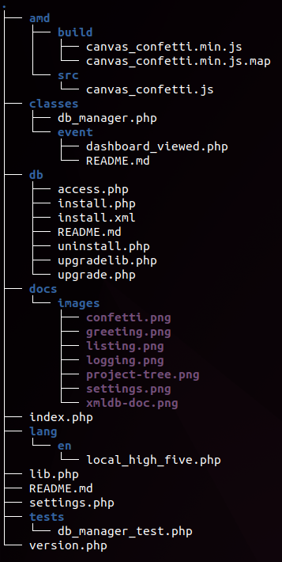
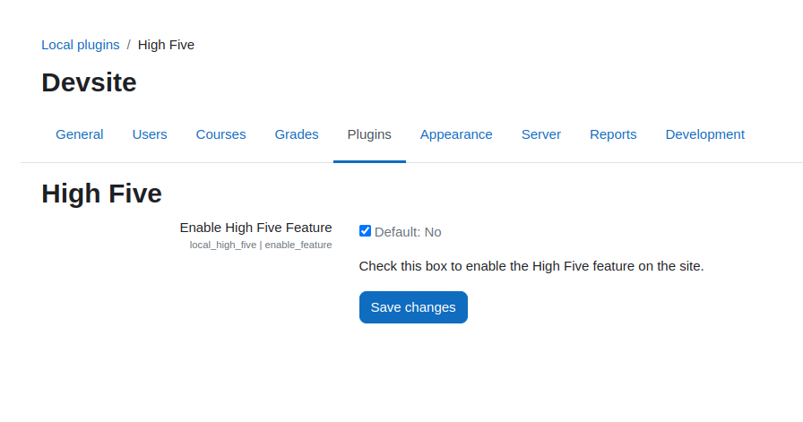

# Moodle Plugin Template

Use this template as a starting point for developing Moodle plugins.

**STATUS:** This is a work-in-progress, supporting discussions on best practices.



## Key features

This template provides a structured, best-practice-compliant foundation for developing Moodle plugins, including:

- 📝 Installation instructions for users
- 🔧 Build system and CI/CD setup using GitHub Actions
- 🌍 Localization for all strings
- ✅ Automated code style checks
- 🚀 Optional: Unit tests, Behat tests, logging, and AMD integration

### Functional Examples

This repository offers a functional example of a Moodle plugin, with features like:

- [x] **Database initialization and upgrade** scripts
- [ ] **Dashboard Context block** (`CONTEXT_USER`) to display content on student dashboards ("My home")
- [ ] **Course content block** (`CONTEXT_COURSE`) to display content on course pages
- [ ] **Activity block** (`CONTEXT_MODULE`) to display content on activity pages
- [x] **Settings page** to configure the plugin using the standard Moodle admin settings interface
- [ ] **Admin page** to access functionality of this plugin that only administrators should see
- [ ] **Scheduled task** to run background processing
- [x] **Custom JavaScript**: Demonstrates using AMD to load JavaScript in Moodle. Clicking the high-five emoji triggers a confetti effect, showcasing how to integrate JavaScript with Moodle.
- [x] **Unit test example** to ensure the plugin works as expected in the Catalyst CI system.
- [x] **Event Logging Example** demonstrates how to log events in Moodle using the Events API.

You can use these features as they are, modify them, or remove what you don’t need.

***

## Best practices and resources

Follow these best practices to enhance and maintain your plugin:

- **JavaScript Compilation:** [Moodle Node.js Guide](https://moodledev.io/general/development/tools/nodejs)
- **AMD Compilation:** Examples:
   - [h5p plugin](https://github.com/h5p/moodle-mod_hvp)
   - [attendance plugin](https://github.com/danmarsden/moodle-mod_attendance/tree/MOODLE_404_STABLE/amd)
- **CI Setup:** [Moodle CI Guide](https://moodlehq.github.io/moodle-plugin-ci/)
- **General Examples:** [attendance plugin](https://github.com/danmarsden/moodle-mod_attendance)

***

## Making your own plugin

1. **Fork this repository** and rename it according to Moodle conventions:
   - Format: `moodle-<type>_<pluginname>` (e.g., `moodle-local_example`)
   - `<type>` should match Moodle’s [plugin types](https://moodledev.io/docs/apis/plugintypes).

2. **Customize the README**: Replace content below this line to describe your plugin.

3. **Publish and Release**: Remove this line and above, then publish your repository as version 1.0.0!

***

# High Five plugin

Enable students to "high five" each other! Enhance engagement and community.

Supported Moodle versions: 

## Features

### 🎉 High Five page at `/local/high_five/`


  


### ⚙️ **Settings page** to configure the plugin behavior.

- The **High Five** plugin includes a settings page for enabling or disabling the High Five feature.
- Access the settings at: `Site administration > Plugins > Local plugins > High Five`.



***

## Quick start with playground

Set up a Moodle environment in minutes for testing your plugin locally:

### Steps:

1. **Install Docker**:
   - Recommended for Mac: [OrbStack](https://orbstack.dev/)
   - Windows/Linux: (add recommended option)

2. **Prepare Moodle Directory**:
   ```sh
   cd ~/Developer
   mkdir moodle-playground && cd moodle-playground


## Quick start playground

:runner: Run a Moodle playground site with *High Five* on your own computer in under 5 minutes! Zero programming or Moodle experience required.

1. Install a Docker system:

   1. On macOS we currently recommend [OrbStack](https://orbstack.dev/). This is the only software which can install Moodle in under 5 minutes. We would prefer if an open source product can provide this experince, but none such exists. See [references](#references) below if you may prefer another option.
   2. On Windows (TODO: add open source recommendation)
   3. On Linux (TODO: add open source recommendation)

2. Create a Moodle testing folder. You will use this to test this plugin, but you could also mix in other plugins onto the same system if you like.

   ```sh
   cd ~/Developer
   mkdir moodle-playground && cd moodle-playground
   ```

3. Install the latest version of Moodle:

   ```sh
   # Visit https://moodledev.io/general/releases to find the latest release, like X.Y.
   
   export BRANCH=MOODLE_X0Y_STABLE # update X and Y here to match the latest release version
   git clone --depth=1 --branch $BRANCH git://git.moodle.org/moodle.git
   ```

   *:information_source: If you see the error "fatal: Remote branch MOODLE_X0Y_STABLE not found in upstream origin", please reread instruction in the code comment and try again.*

4. Install this plugin into your Moodle playground:

   ```sh
   git clone https://github.com/fulldecent/moodle-local_plugin_template.git moodle/local/high_five
   ```

5. Get and run Moodle Docker container (instructions adapted from [moodle-docker instructions](https://github.com/moodlehq/moodle-docker)):

   ```sh
   git clone https://github.com/moodlehq/moodle-docker.git
   cd moodle-docker # You are now at ~/Developer/moodle-playground/moodle-docker
   
   export MOODLE_DOCKER_WWWROOT=../moodle
   export MOODLE_DOCKER_DB=pgsql
   bin/moodle-docker-compose up -d
   bin/moodle-docker-wait-for-db
   
   cp config.docker-template.php $MOODLE_DOCKER_WWWROOT/config.php
   bin/moodle-docker-compose exec webserver php admin/cli/install_database.php --agree-license --fullname="Docker moodle" --shortname="docker_moodle" --summary="Docker moodle site" --adminpass="test" --adminemail="admin@example.com" --adminuser='admin'
   ```

   *:information_source: If you see the error "Database tables already present; CLI installation cannot continue", please follow the "teardown" instructions below and then try again.*

   *:information_source: If you see the error "!!! Site is being upgraded, please retry later. !!!", and "Error code: upgraderunning…", please ignore the error and proceed.*

6. :sun_with_face: Now play with your server at https://localhost:8000

   1. Click the top-right to login.
   2. Your username is `admin` and your password is `test`.

   *:information_source: If you see a bunch of stuff and "Update Moodle database now", then click that button and wait. On a M1 Mac with 8GB ram, we saw this take 5 minutes for the page to finish loading.*

7. To completely kill your playground so that next time you will start with a blank slate:

   ```sh
   bin/moodle-docker-compose down --volumes --remove-orphans
   colima stop
   ```

If you have any further questions about the playground setup, customizing it or other error messages, please documentation at https://github.com/moodlehq/moodle-docker and contact that team.

## Install

To install High Five on your quality assurance server or your production server, do the same thing as the plaground example above:

1. ```sh
   git clone https://github.com/fulldecent/moodle-local_plugin_template.git local/high_five
   ```

2. Load your website in the browser to set up plugins.

***

## Using AMD in This Plugin Template

The **High Five** plugin demonstrates how to integrate **AMD (Asynchronous Module Definition)** in Moodle to load JavaScript modules asynchronously, improving performance.

📢 For **non-developers** running the plugin:  
You don’t need to worry about the build process. Just use the already-built files.

### How It Works

1. **High Five Emoji & Confetti Effect**  
   When the high-five emoji (`🖐️`) is clicked at `/local/high_five/`, an AMD module is loaded, triggering a confetti effect.


2. **Build Process**
   - JavaScript code is written in the `amd/src/` folder and compiled into the `amd/build/` directory.
   - The built files in the `build` folder are used by Moodle, dynamically loaded when the emoji is clicked.

### 🎯 JavaScript Development Process

#### Building the AMD Module

To compile the AMD modules:

1. **Set up Grunt**  
   Follow the [Moodle Node.js tools documentation](https://moodledev.io/general/development/tools/nodejs) to install and configure **Grunt**.

2. **Run the Build Command**  
   After setting up Grunt, run:
   ```bash
   grunt
   ```

This will compile the AMD modules and place the final files in the amd/build/ folder.

#### Best Practice for Pushing Build Artifacts to GitHub

1. **Push Build Artifacts**
   - **When**: For production-ready plugins where users may not rebuild assets.
   - **Why**: Ensures consistent functionality across all environments, even for users who don't rebuild the plugin.

2. **Exclude Build Artifacts**
   - **When**: If the repository should stay lean, and CI systems handle builds.
   - **Why**: Keeps the repository clean and reduces its size, but requires users to build assets locally.

**Recommended**: For Moodle plugins, it's often easier to **push build artifacts** to GitHub to simplify deployment.


***

## Contributing

Please send PRs to our [main branch](https://github.com/fulldecent/moodle-local_plugin_template).

***

## References

1. This module is built based on [best practices documented in moodle-local_plugin_template](https://github.com/fulldecent/moodle-local_plugin_template).
2. Setting up Docker
   1. We would prefer an open-source-licensed Docker implementation that runs at native speed on Mac, Linux and Windows. For Mac, you may prefer to [install Colima](https://github.com/abiosoft/colima?tab=readme-ov-file#installation) which is open source but about 5x slower than the OrbStack recommended above.
3. Setting up playground
   1. If you require a few courses and users to test your plugin, you may want to look at the [generator tool](https://moodledev.io/general/development/tools/generator).
4. Continuous integration
   1. This plugin uses [the Moodle CI suite recommended by Catalyst](https://github.com/catalyst/catalyst-moodle-workflows)
   2. Perhaps we would prefer the CI suite provided by Moodle, but their approach [does not allow you to set it once and forget it](https://github.com/moodlehq/moodle-plugin-ci/issues/323)
5. JavaScript Modules in Moodle. For best practices on how to use JavaScript modules in Moodle,
   including the use of AMD for asynchronous loading, check the [Moodle JavaScript Modules Documentation](https://moodledev.io/docs/4.5/guides/javascript/modules).