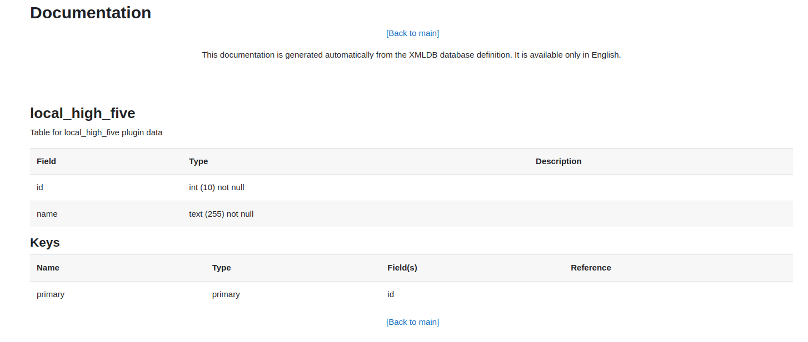

# Database Schema

This directory contains schema files for managing the installation, upgrade, and uninstallation of the Moodle plugin's database, along with custom database interactions and data cleanup.

## Files

### `install.xml`
Defines tables, fields, keys, and relationships, and is automatically read during installation to create the database schema.
- Use the [Moodle XMLDB Editor](https://moodledev.io/general/development/tools/xmldb) to ensure compatibility with Moodle's database structure.
- You can check the generated schema in the Moodle XMLDB tool at:  
  [Moodle XMLDB Editor](https://your-url/admin/tool/xmldb/)
  - Search for `local/high_five/db` to find the database schema.
  - This documentation is generated automatically from the XMLDB database definition and is available only in English.
  

### `install.php` (optional)
Handles additional setup tasks during installation, such as initializing default settings, creating extra tables, or pre-loading data. Moodle automatically runs this file if it exists.

### `upgradelib.php` (optional)
Contains functions for upgrading the database schema. It is automatically called by Moodle during upgrades.

### `uninstall.php` (optional)
Handles data cleanup when uninstalling the plugin.

### `db_manager.php`
**Location**: `classes/db_manager.php`  
Encapsulates database interactions (CRUD) and simplifies schema changes and SQL queries. It's similar to Moodle's [`moodle_database.php`](https://github.com/moodle/moodle/blob/MOODLE_405_STABLE/lib/dml/moodle_database.php), enabling more efficient database management.

### Examples of commonly used plugins using database management functions:
- **Configurable Reports**: Uses `$DB->get_record` and other database methods for querying and reporting.  
  [Configurable Reports GitHub Repository](https://github.com/jleyva/moodle-block_configurablereports)
- **Ad-hoc Database Queries**: Allows custom database queries using `$DB` methods.  
  [Ad-hoc Database Queries GitHub Repository](https://github.com/moodleou/moodle-report_customsql)
- **Attendance Plugin**: Handles session records with Moodle's DB methods.  
  [Attendance Plugin GitHub Repository](https://github.com/danmarsden/moodle-mod_attendance)

## Best Practices
- Keep `install.xml` simple and follow Moodle’s XMLDB schema standards.
- Use `upgradelib.php` for version-specific database changes.
- Document schema changes for future reference.

## Resources
- [Data Manipulation API](https://moodledev.io/docs/4.5/apis/core/dml)
- [Moodle XMLDB Documentation](https://docs.moodle.org/dev/XMLDB)
- [Plugin Development Guidelines](https://docs.moodle.org/dev/Plugin_contribution)
